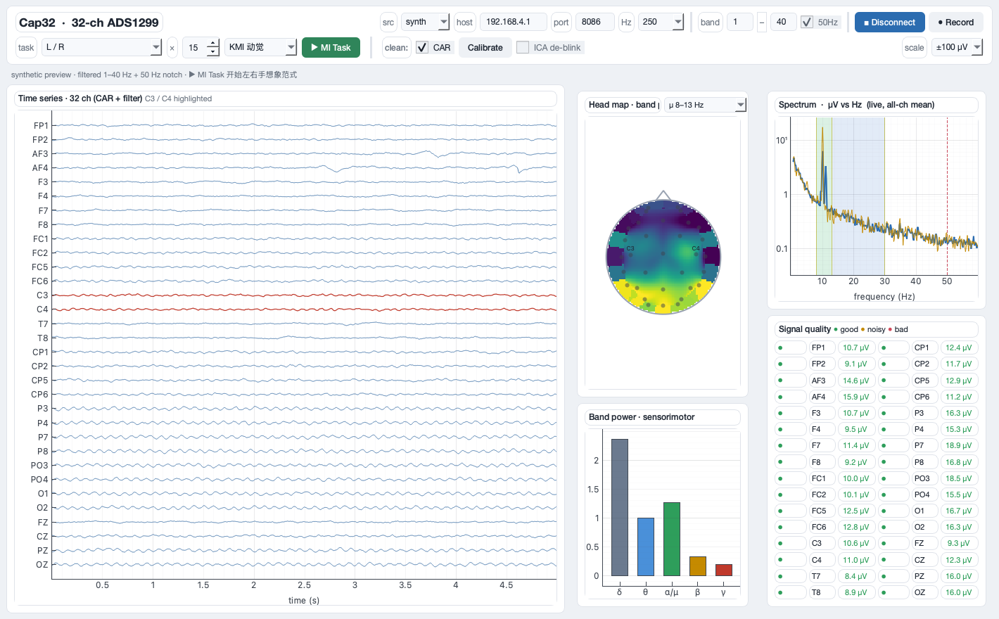

# EEG_MI — Motor imagery on a 32-channel dry-electrode cap

Decoding **motor imagery (MI)** from a 32-channel dry-electrode EEG cap
(TI ADS1299, 250 Hz, WiFi/UDP), with two goals: reach usable accuracy with
**minimal per-subject retraining**, and find out whether **EEG foundation models**
actually help on hardware like this.

Everything here is measured on one cap and one subject. The reports say plainly
what the data supports and what it does not.



## What we found

| Question | Answer |
|---|---|
| Left hand vs right hand | **Not decodable** (p = 0.41). A dry cap does not resolve C3 vs C4 well enough. |
| Both hands vs rest | **Decodable**, AUC 0.83–0.87 (n = 19, breadth search over 115 pipelines) |
| Hands vs feet | AUC 0.704, p = 0.040 in mu (8–13 Hz) on 17 central+frontal channels — exploratory, selection-biased |
| Do foundation models beat classical? | **No.** Seven frozen backbones, none beat CSP/Riemannian tangent space + LR (0.790) |
| Channel-to-channel crosstalk | Not detectable; bounded at −24 dB by a measurement whose floor was set by open inputs |

The single most useful negative result: the first foundation-model ranking was an
artifact of **zero padding**. Feeding a 3 s trial to a checkpoint built for 15 s made
80 % of LaBraM's input zeros, and the probe read the padding. BENDR's "best-in-class"
0.733 became 0.303 once the input was fixed. `src/foundation/embed_health.py` is the
pre-flight gate that now has to pass before any probe score is interpreted.

## Reports

| | |
|---|---|
| [`docs/mi_pilot_report.pdf`](docs/mi_pilot_report.pdf) | MI pilot: ERD/ERS, breadth search, foundation-model benchmark (中文) |
| [`docs/crosstalk_report.pdf`](docs/crosstalk_report.pdf) · [`_zh`](docs/crosstalk_report_zh.pdf) | Crosstalk measured with an external generator (EN / 中文) |
| [`docs/hardware_acceptance.pdf`](docs/hardware_acceptance.pdf) | Noise, DC, mains, crosstalk acceptance suite (中文) |
| [`docs/impedance_injection_report.pdf`](docs/impedance_injection_report.pdf) | Reverse-engineering the 31.2 Hz impedance injection (中文) |
| [`docs/network_setup.md`](docs/network_setup.md) | Recording over the cap's WiFi AP without losing internet |
| [`research/`](research/) | MI + foundation-model survey, per-model input contracts, OpenBCI notes |

## Data

The recordings are published separately, with a data card and a standalone loader:
**[huggingface.co/datasets/Twu31/cap32-mi-eeg](https://huggingface.co/datasets/Twu31/cap32-mi-eeg)**

Raw µV, unfiltered, pre-CAR, **all 32 channels retained** — including the ones that
were dead in that session. Read the data card before analysing: one session lost 31
of its 50 trials to a receiver stall, and another has a visual confound during imagery.

## Layout

```
src/
  common/montage.py          32-ch 10–20 montage + ADC scaling (µV = counts × 0.02235)
  acquisition/               cap → GUI/LSL: framing, MI paradigm, impedance, hardware tests
  experiment/mi_paradigm.py  full-screen cue window (fixation → cue → imagery → rest)
  analysis/                  epoching, artifact handling, breadth search over pipelines
  foundation/                frozen-backbone probing + the representation-health gate
  baselines/                 CSP / Riemannian baselines on MOABB (BCI IV-2a/2b)
docs/       reports (LaTeX + PDF); preamble.tex is shared by all of them
research/   surveys and notes written before the hardware arrived
results/    figures and metrics reproduced by the scripts above
```

## Getting started

```bash
conda create -n eegmi python=3.11 && conda activate eegmi
pip install -r requirements-cpu.txt      # baselines, analysis (no GPU)
pip install -r requirements-dl.txt       # torch (MPS) + braindecode + foundation models
```

Without hardware, everything still runs on the synthetic source:

```bash
python src/acquisition/cap_gui.py --source synth
```

With the cap: join its `ESPBCI` access point, set a static IP of `192.168.4.2`
(see [`docs/network_setup.md`](docs/network_setup.md)), then

```bash
python src/acquisition/cap_gui.py --source udp
```

## Notes on the hardware

The cap is a low-cost DIY-class device, and several of its documented behaviours were
wrong or absent, so they were measured rather than trusted: the frame layout, the
lowercase command set, the 31.2 Hz impedance injection current (~24 nA, not µA), and
the vendor's two mutually inconsistent impedance formulas. `src/acquisition/` contains
the test scripts for each. Vendor manuals and software are **not** redistributed here.

## License

MIT for the code. The recordings are CC BY 4.0 — see the dataset card.
